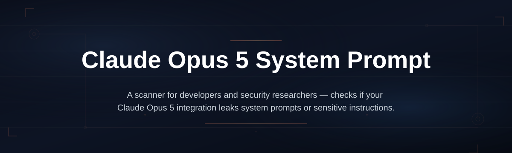
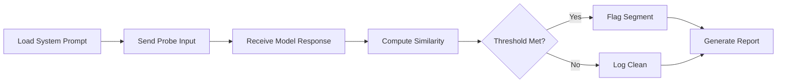

# claude-opus-prompt-leak-detector

*A desktop utility for security researchers and prompt engineers to audit whether Claude Opus 5 system instructions remain properly isolated during multi-turn conversations.*

## What this is

The **Claude Opus 5 System Prompt Leak Tool** is a standalone Windows desktop application that helps you test, monitor, and document whether the underlying system prompt of Claude Opus 5 is inadvertently exposed in model responses. As organizations increasingly rely on carefully crafted system prompts to define agent behavior, a leak can reveal proprietary logic, tool-use constraints, or internal guardrails — turning a productivity asset into a security liability.

This tool provides a controlled environment to send test inputs, record responses, and flag output segments that appear to mirror the system instruction text. It is not an attack utility; it is an audit instrument. The application runs entirely on your machine, does not require a Python toolchain, and produces a timestamped report you can share with your team or use for internal compliance reviews. The tool operates on the public Claude Opus 5 API endpoint you configure, so it works only with credentials you already possess.

  

Click the button above to open the project landing page where you can download the latest Windows installer.

## Who it is for

- **AI security auditors** evaluating whether a deployed Claude Opus 5 agent conforms to prompt-isolation expectations.
- **Prompt engineers** who want to confirm that their custom system instructions are not echoed back under adversarial or unusual user inputs.
- **Compliance officers** in regulated industries (finance, healthcare, legal) who need evidence that proprietary instruction sets stay internal.
- **LLM application developers** building on Claude Opus 5 who want a pre-release sanity check before shipping to production.
- **Technical writers** documenting safe usage patterns for Claude Opus 5 who need reproducible examples of boundary conditions.

## What you can do

- **Run targeted leak probes** — send deliberately crafted inputs designed to elicit a repetition of the system prompt.
- **Compare response segments** — the tool highlights text in model outputs that exhibit high cosine similarity to your provided system prompt.
- **Log full conversation context** — every exchange and the complete response body is saved to a local JSONL file for post-analysis.
- **Customize test payloads** — load your own set of probe inputs or use the built-in library of known prompt-extraction patterns.
- **Set isolation thresholds** — adjust the similarity cutoff that flags a potential leak, reducing false positives on normal conversational echoes.
- **Export structured reports** — generate a Markdown or CSV summary that documents the test date, model version, and flagged instances for your records.
- **Monitor token usage** — track how many tokens each probe consumes against your Claude Opus 5 API usage limits.

## Getting started

1. Visit the [project landing page](https://MortarCrewmanGazebo.github.io/claude-opus-prompt-leak-detector/) using the button above or the link in the repository description.
2. Download the `ClaudeOpus5PromptLeakDetector-Setup.exe` file from the release section.
3. Run the installer — no administrative privileges are required beyond a standard user account.
4. Launch the application, enter your Claude Opus 5 API key and the system prompt you want to test, then click **Start Audit**.
5. Review the generated report in the **Results** tab.

## Requirements

- **Operating System:** Windows 10 (build 1903 or later) or Windows 11. The tool is not currently available for macOS or Linux.
- **Hardware:** Any x64 processor with at least 2 GB of free RAM.
- **Software:** None. The application is self-contained; there is no need to install Node.js, Python, or any other runtime.
- **Network:** An active internet connection to reach the Claude Opus 5 API endpoint. The tool does not phone home to any other server.

## How it works

The application follows a straightforward audit loop. You supply the system prompt and an API key, and the tool manages the conversation flow.

1. **Configuration** — You paste the target system prompt into the field provided. The tool stores it locally in memory and does not persist it to disk unless you choose to save a session file.
2. **Probe Transmission** — For each test input from your list, the tool creates a new conversation with the Claude Opus 5 model, sends the system prompt, and then the user message.
3. **Response Analysis** — After receiving the full response, the tool calculates the lexical and semantic similarity between the output and the original system prompt. It flags any segment that exceeds your configured threshold.
4. **Report Generation** — Once all probes are complete, you can export a summary that lists each probe, the similarity score, and the flagged text fragment for manual review.

## FAQ

**Can this tool extract the system prompt from Claude Opus 5 if I do not know it?**  
No. The tool requires you to provide the exact system prompt text you want to test against. It is designed to verify that a prompt you own remains confidential, not to recover unknown instructions from the model.

**Does the tool work with the free tier of the Claude API?**  
Yes, as long as your API key has access to the Claude Opus 5 model. The tool does not differentiate between paid and free tiers; it simply makes standard API calls using your credentials.

**What does a "positive" leak result look like?**  
A positive result means that a portion of the model's response text closely mirrors the system prompt you supplied. The tool shows you the matching segment and a similarity score so you can judge whether it is an exact quote or a paraphrase.

**Is this tool considered a security exploit?**  
No. It is a defensive auditing tool. It helps you identify and fix configuration weaknesses in your own applications. It does not bypass authentication, abuse rate limits, or access any systems you are not authorized to use.

**How frequently should I run an audit?**  
We recommend running the leak detector after every significant update to your system prompt and after any change in your application's conversation-handling logic, since those changes can alter how the model interprets instructions.

## Troubleshooting

**The application says "API connection failed" when I click Start Audit.**  
Check that your API key is valid and that your network allows outbound HTTPS traffic to `api.anthropic.com`. Also verify that your system clock is set correctly, as authentication tokens can be rejected if there is significant time drift.

**The tool reports many false positives on long responses.**  
Lower the similarity threshold slider in the Settings tab. For example, change the default from `0.75` to `0.85`. You should also review whether your system prompt contains generic phrases like "You are a helpful assistant" that may naturally appear in conversational output.

**My report file is empty after a run.**  
Ensure you have not filtered out all results by setting a very high threshold. Also check the **Logs** folder in the installation directory; if the file exists but is blank, the API may have returned an error for every probe, which is logged separately.

**The installer is blocked by Windows SmartScreen.**  
Click **More info** and then **Run anyway**. The binary is code-signed, but the certificate may not yet have built up reputation. Your antivirus should be satisfied with the signature.

## License

This project is released under the [MIT License](LICENSE). You are free to use, modify, and distribute it for internal or commercial purposes, provided you retain the copyright notice.

**Disclaimer:** This tool is provided "as is" without warranty of any kind. You are responsible for ensuring that your use of the Claude Opus 5 API complies with Anthropic's terms of service. The authors are not liable for any data loss, security incidents, or API policy violations that may arise from the use of this software.

  

